# 🖥️ Pràctica d'Active Directory: Creació d'OU, Grups, Usuaris i Recurs Compartit

Aquesta guia documenta pas a pas la configuració d'un entorn bàsic d'Active Directory a Windows Server. L'objectiu és crear una Unitat Organitzativa (OU), grups de seguretat, usuaris i compartir una carpeta amb permisos específics.

---

## 📸 Captura 1 – Server Manager

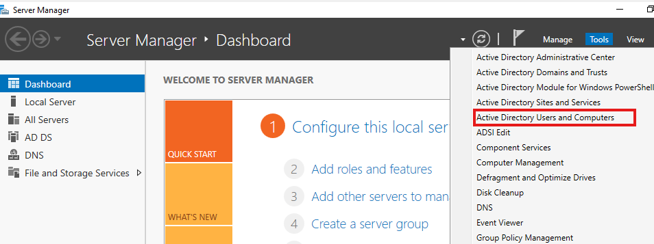

**Què s'hi veu?**  
Eina principal d'administració del servidor.

**Què s'està fent?**  
S'està preparant l'entorn per obrir eines com *Active Directory Users and Computers*.

---

## 📸 Captura 2 – Active Directory Users and Computers (menú contextual)

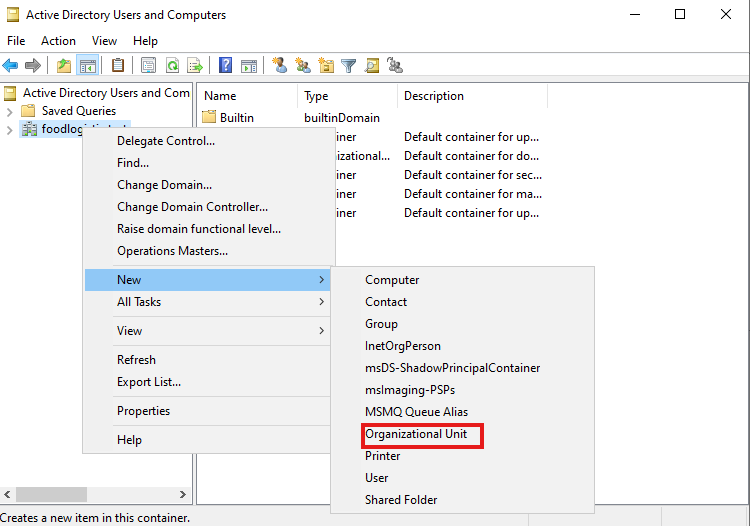

**Què es veu?**  
Opcions per crear nous objectes dins del contenidor.

**Què s'està fent?**  
S'utilitza aquest menú per crear grups, usuaris i OU.

---

## 📸 Captura 3 – Creació de l'OU

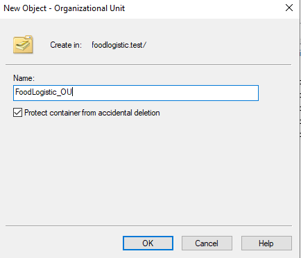

**Nom de l'OU:** `FoodLogistic_OU`

**Què s'està fent?**  
Es crea una Unitat Organitzativa dins del domini `foodlogistic.test` per organitzar usuaris i recursos del departament de logística.

---

## 📸 Captura 4 – Menú New (contextual)

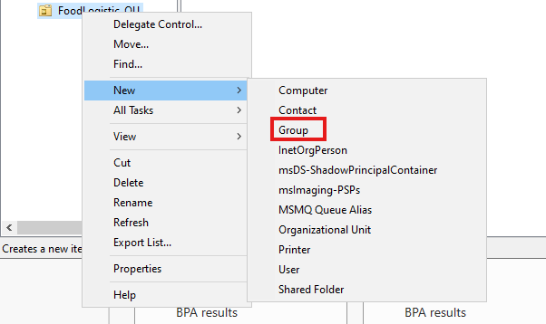

**Què es veu?**  
Llista d'objectes que es poden crear dins d'un contenidor.

**Què s'està fent?**  
Es mostra el menú desplegable per seleccionar el tipus d'objecte a crear (grup, usuari, etc.).

---

## 📸 Captura 5 – Creació del grup Administracio

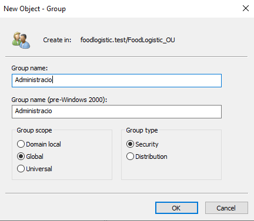

**Nom:** `Administracio`  
**Àmbit:** Global  
**Tipus:** Security

**Què s'està fent?**  
Es crea un grup de seguretat per a personal d'administració dins de `FoodLogistic_OU`.

---

## 📸 Captura 6 – Creació del grup Transport

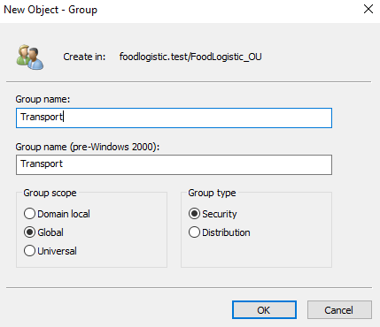

**Nom:** `Transport`  
**Àmbit:** Global  
**Tipus:** Security

**Què s'està fent?**  
Grup per a usuaris del departament de transport.

---

## 📸 Captura 7 – Creació del grup Direccio

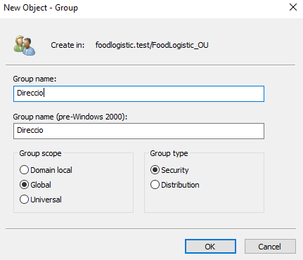

**Nom:** `Direccio`  
**Àmbit:** Global  
**Tipus:** Security

**Què s'està fent?**  
Grup per a usuaris de direcció.

---

## 📸 Captura 8 – Menú New (altra vista)

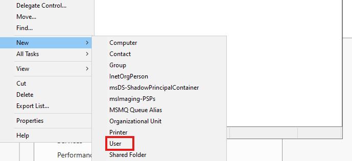

**Què es veu?**  
Opcions per crear nous objectes.

**Què s'està fent?**  
Es torna a mostrar el menú contextual per confirmar les opcions disponibles.

---

## 📸 Captura 9 – Creació de l'usuari Admin

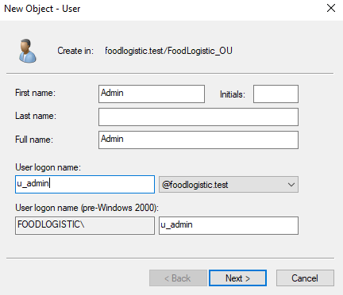

**Usuari:** `u_admin`  
**Nom complet:** Admin

**Què s'està fent?**  
Es crea un usuari dins `FoodLogistic_OU` amb nom d'inici de sessió `u_admin@foodlogistic.test`.

---

## 📸 Captura 10 – Creació de l'usuari Transport

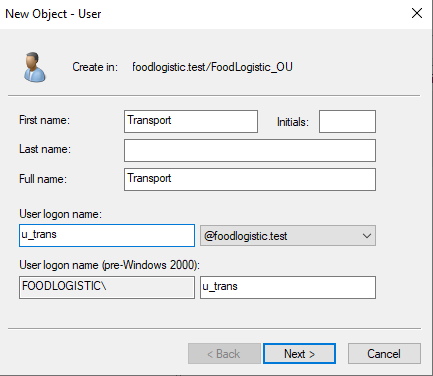

**Usuari:** `u_trans`  
**Nom complet:** Transport

**Què s'està fent?**  
Segon usuari, associat al departament de transport.

---

## 📸 Captura 11 – Vista final dels usuaris i grups

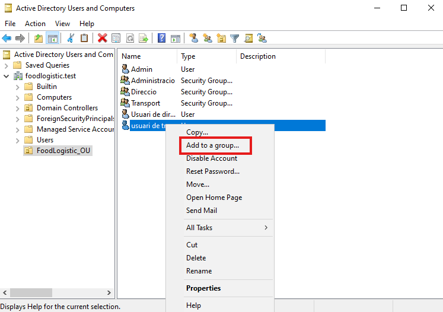

**Què es veu?**  
Dins `FoodLogistic_OU` apareixen:
- Usuaris: `Admin`, `Transport`, `Usuari de dir...`
- Grups: `Administracio`, `Direccio`, `Transport`

---

## 📸 Captura 12 – Confirmació d'operació

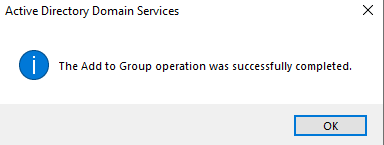

**Missatge:**  
`The Add to Group operation was successfully completed`

**Què s'està fent?**  
S'ha afegit un usuari a un grup correctament.

---

## 📸 Captura 13 – Explorador de fitxers (C:\)

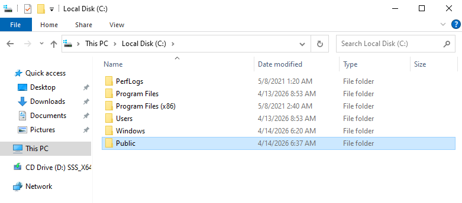

**Què es veu?**  
Carpeta `Public` a l'arrel del disc `C:\`.

**Què s'està fent?**  
Es localitza la carpeta que es vol compartir.

---

## 📸 Captura 14 – Menú contextual de Public

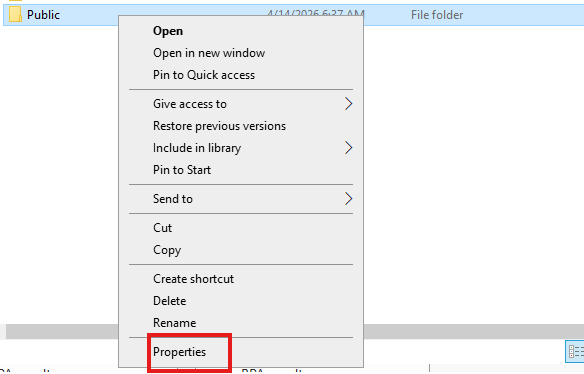

**Què es veu?**  
Opcions com *Properties*, *Give access to*, *Share*.

**Què s'està fent?**  
S'accedeix a les propietats per compartir la carpeta.

---

## 📸 Captura 15 – Propietats: pestanya Sharing

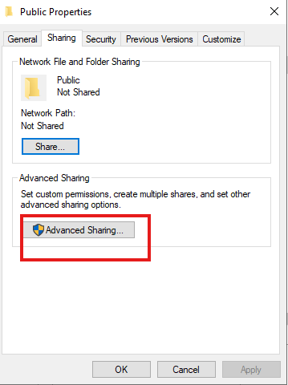

**Estat:** `Not Shared`

**Què s'està fent?**  
Es comença a configurar l'accés en xarxa a la carpeta `Public`.

---

## 📸 Captura 16 – Advanced Sharing

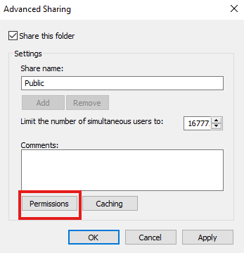

**Opció activada:** `Share this folder`  
**Nom del recurs:** `Public`

**Què s'està fent?**  
Es defineix el nom amb què es compartirà la carpeta a la xarxa.

---

## 📸 Captura 17 – Permisos de compartició

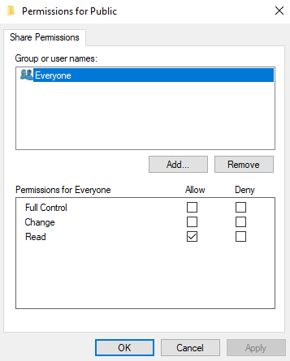

**Grup/usuri:** `Everyone`  
**Permís marcat:** `Read`

**Què s'està fent?**  
Es permet a tothom llegir el contingut de la carpeta compartida.

---

## 📸 Captura 18 – Pestanya Security (NTFS)

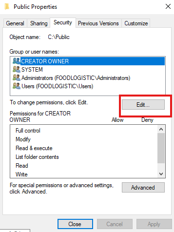

**Què es veu?**  
Permisos NTFS per a `CREATOR OWNER`, `SYSTEM`, `Administrators`, `Users`.

**Què s'està fent?**  
S'estan revisant els permisos locals abans de modificar-los.

---

## 📸 Captura 19 – Edició de permisos NTFS

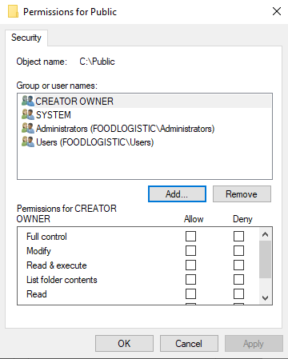

**Botó:** `Add...`

**Què s'està fent?**  
S'està a punt d'afegir un grup o usuari a la llista de permisos NTFS.

---

## 📸 Captura 20 – Selecció d'objectes

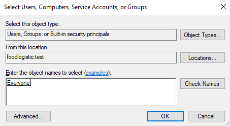

**Ubicació:** `foodlogistic.test`  
**Nom introduït:** `Everyone`

**Què s'està fent?**  
S'afegeix el grup `Everyone` als permisos NTFS per permetre accés bàsic des de la xarxa.

## 📸 Captura 21 – Permisos NTFS amb Everyone afegit

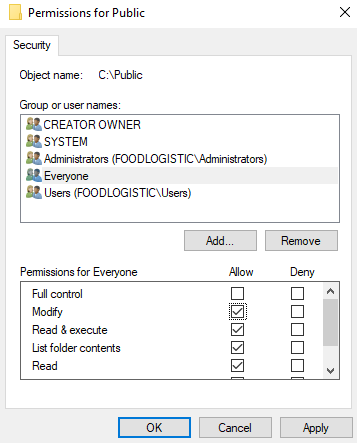

**Què es veu?**  
El grup `Everyone` ja apareix a la llista de permisos NTFS de la carpeta `Public`.

**Què s'està fent?**  
Es confirma que `Everyone` té permisos de `Read` per accedir a la carpeta.

---

## 📸 Captura 22 – Server Manager (Dashboard)

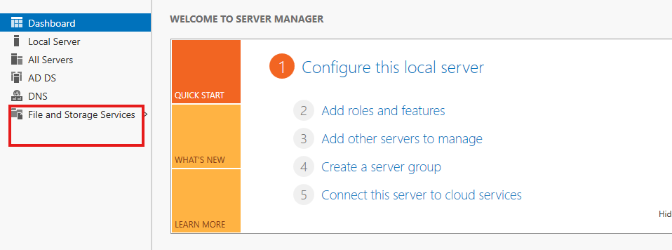

**Què es veu?**  
El panell principal del Server Manager amb les opcions de configuració.

**Què s'està fent?**  
Es navega per les eines del servidor per gestionar els recursos compartits.

---

## 📸 Captura 23 – File and Storage Services > Servers

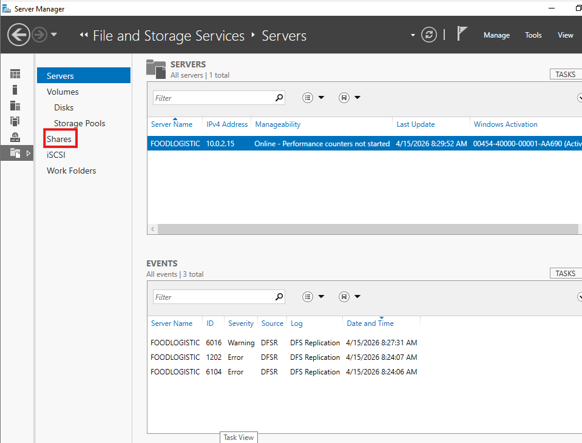

**Què es veu?**  
Llista de servidors i esdeveniments del sistema.

**Què s'està fent?**  
Es verifica l'estat del servidor `FOODLOGISTIC` i es revisen els errors de DFS Replication.

---

## 📸 Captura 24 – File and Storage Services > Shares

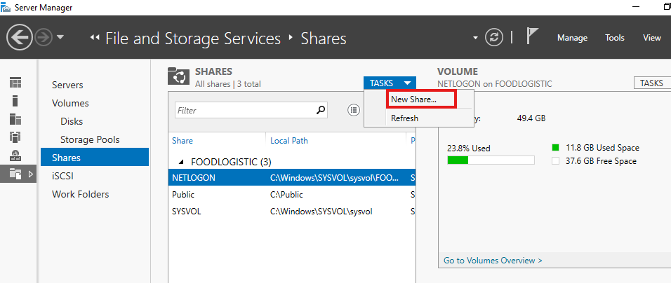

**Què es veu?**  
Llista de recursos compartits actuals: `NETLOGON`, `Public`, `SYSVOL`.

**Què s'està fent?**  
Es visualitzen els shares existents abans de crear-ne un de nou.

---

## 📸 Captura 25 – New Share Wizard (Selecció de perfil)

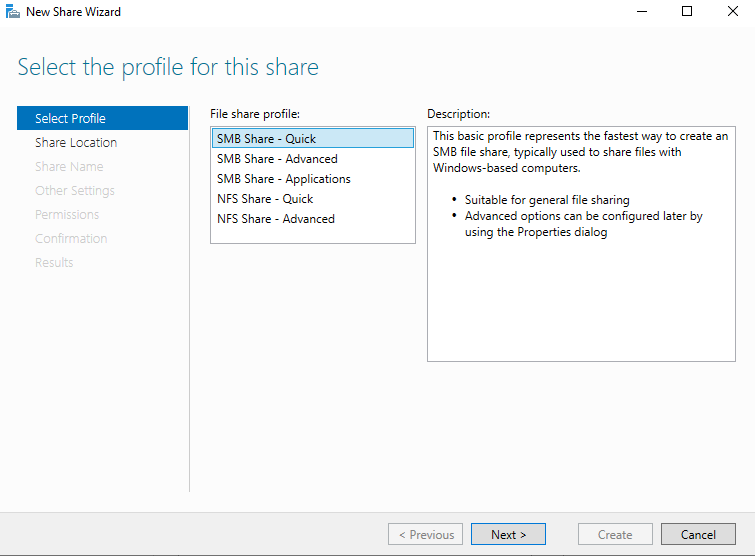

**Què es veu?**  
Opcions de perfil per crear un nou recurs compartit.

**Què s'està fent?**  
Es selecciona `SMB Share - Quick` per crear un share bàsic per a Windows.

---

## 📸 Captura 26 – New Share Wizard (Selecció de ruta)

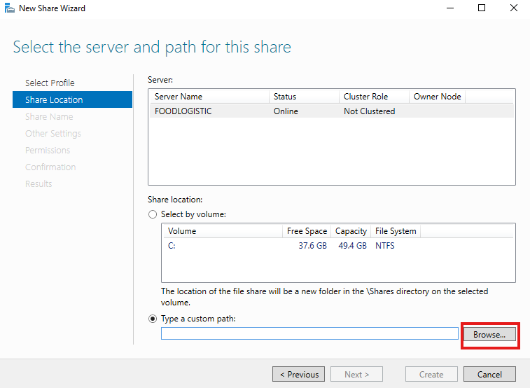

**Què es veu?**  
Selecció del volum i la ubicació del share.

**Què s'està fent?**  
Es tria el volum `C:` per crear la carpeta compartida.

---

## 📸 Captura 27 – Selecció de carpeta

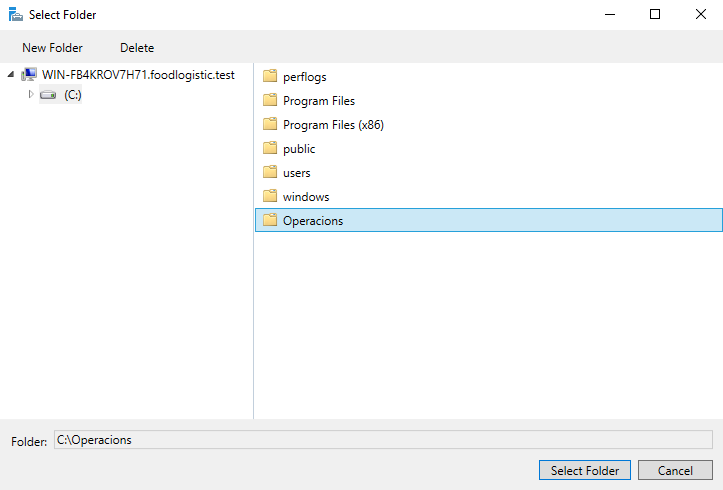

**Què es veu?**  
Explorador per triar o crear una carpeta.

**Què s'està fent?**  
Es selecciona la carpeta `C:\Operacions` per compartir-la.

---

## 📸 Captura 28 – Ruta personalitzada

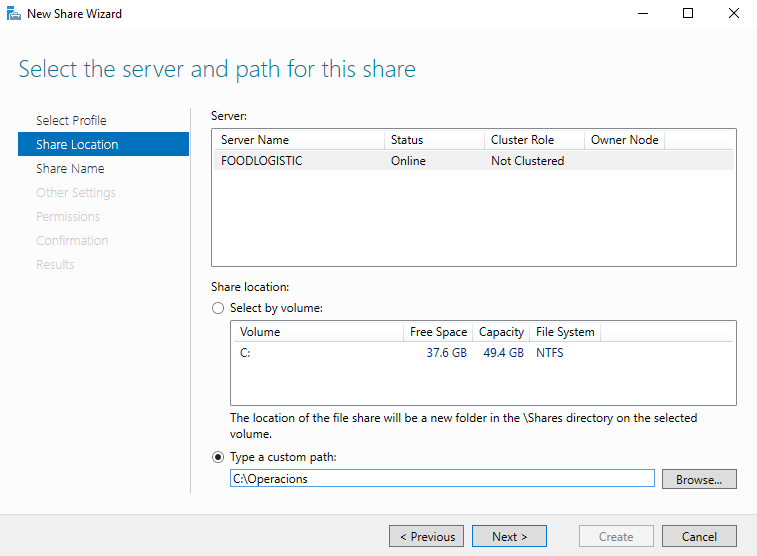

**Què es veu?**  
Ruta personalitzada `C:\Operations`.

**Què s'està fent?**  
Es confirma la ubicació del nou recurs compartit.

---

## 📸 Captura 29 – Configuració avançada del share

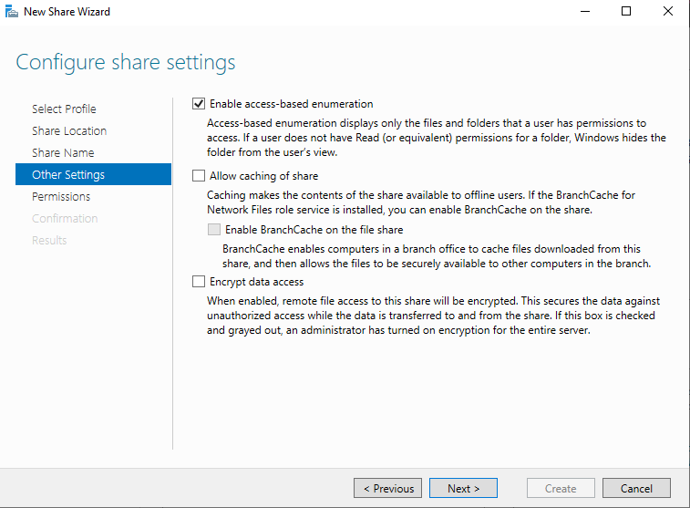

**Què es veu?**  
Opcions com access-based enumeration, caching i BranchCache.

**Què s'està fent?**  
Es configura el comportament del share (sense marcar opcions especials de moment).

---

## 📸 Captura 30 – Permisos del share

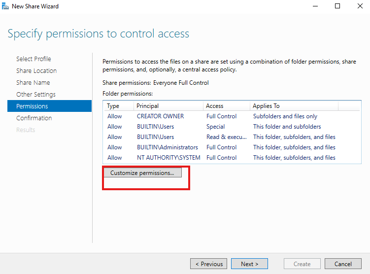

**Què es veu?**  
Permisos de compartició i permisos NTFS per defecte.

**Què s'està fent?**  
Es revisen els permisos abans de crear el share. `Everyone` té `Full Control` a nivell de share.

---

## 📸 Captura 31 – Permisos NTFS heredats

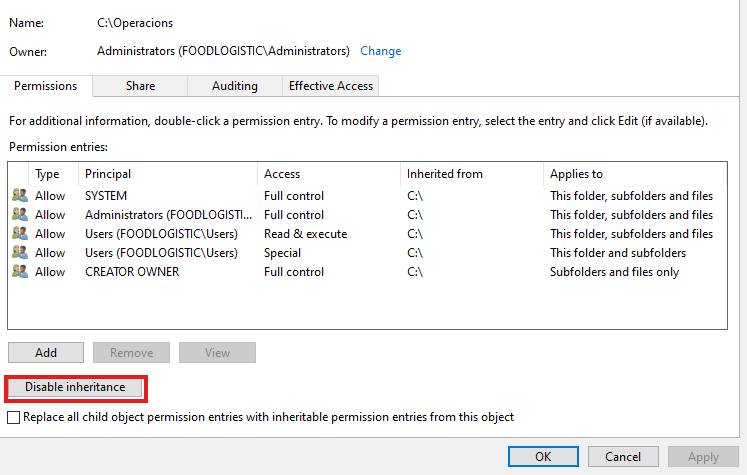

**Què es veu?**  
Permisos heretats de `C:\` per a la carpeta `C:\Operations`.

**Què s'està fent?**  
Es visualitzen els permisos actuals abans de modificar-los.

---

## 📸 Captura 32 – Bloqueig d'herència

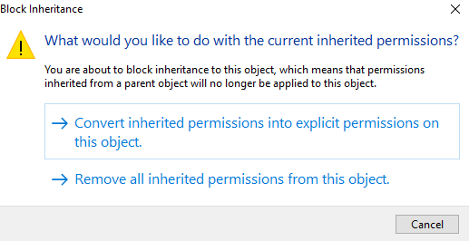

**Què es veu?**  
Opció per bloquejar l'herència de permisos.

**Què s'està fent?**  
Es tria `Convert inherited permissions into explicit permissions` per personalitzar els permisos.

---

## 📸 Captura 33 – Permisos convertits a explícits

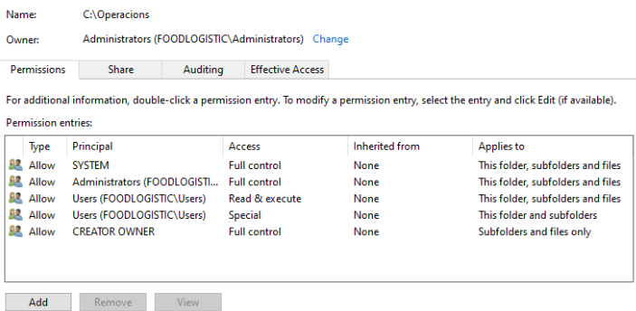

**Què es veu?**  
Els permisos ara tenen `Inherited from: None`.

**Què s'està fent?**  
Els permisos heretats s'han convertit en explícits per poder modificar-los lliurement.

---

## 📸 Captura 34 – Neteja de permisos

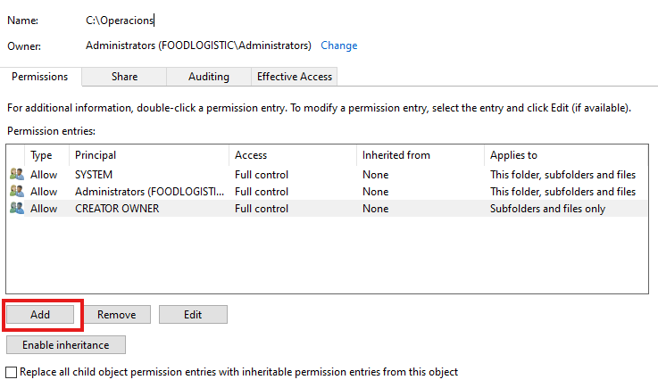

**Què es veu?**  
Només queden `SYSTEM`, `Administrators` i `CREATOR OWNER`.

**Què s'està fent?**  
S'han eliminat els permisos del grup `Users` per començar des de zero.

---

## 📸 Captura 35 – Afegir un nou principal

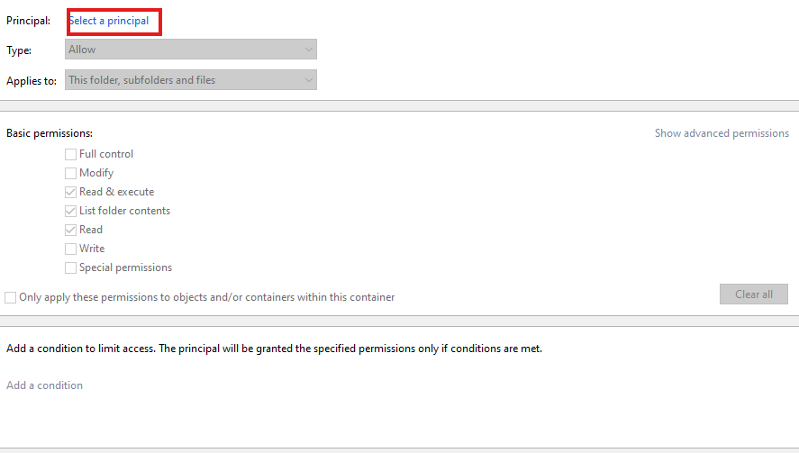

**Què es veu?**  
Finestra per afegir un nou usuari/grup amb permisos.

**Què s'està fent?**  
Es selecciona `Read & execute`, `List folder contents` i `Read` per al nou principal.

---

## 📸 Captura 36 – Selecció del grup Transport

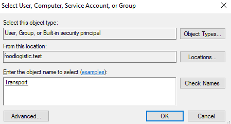

**Què es veu?**  
Cerca del grup `Transport` dins del domini `foodlogistic.test`.

**Què s'està fent?**  
S'afegeix el grup `Transport` als permisos NTFS de la carpeta.

---

## 📸 Captura 37 – Permisos bàsics seleccionats

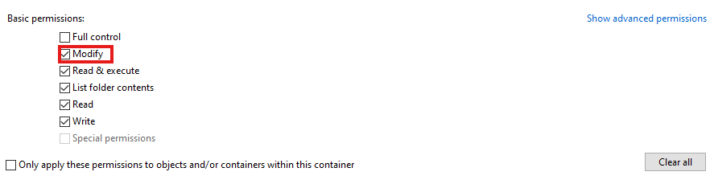

**Què es veu?**  
Permisos `Read & execute`, `List folder contents` i `Read` marcats.

**Què s'està fent?**  
Es confirma que el grup `Transport` tindrà accés de lectura a la carpeta.

---

## 📸 Captura 38 – Creació del share completada

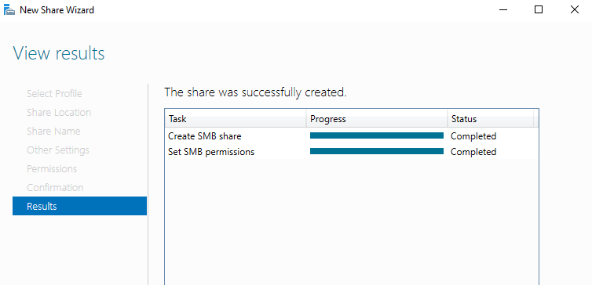

**Què es veu?**  
Missatge de confirmació que el share s'ha creat correctament.

**Què s'està fent?**  
El recurs compartit `Operations` ja està actiu al servidor.

---

## 📸 Captura 39 – Creació de carpeta amb PowerShell

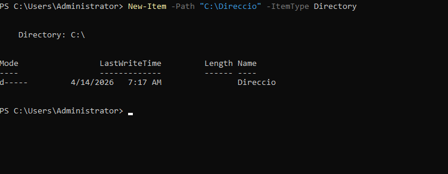

**Què es veu?**  
Comanda `New-Item` per crear la carpeta `C:\Direccio`.

**Què s'està fent?**  
Es crea una nova carpeta des de PowerShell per a un altre recurs compartit.

---

## 📸 Captura 40 – Creació de share amb PowerShell

**Què es veu?**  
Comanda `New-SmbShare` per crear el share `Direccio$`.

**Què s'està fent?**  
Es crea un share ocult (amb `$` al final) amb accés complet per al grup `Direccio`.

## 📸 Captura 41 – Configuració Access-Based Enumeration amb PowerShell

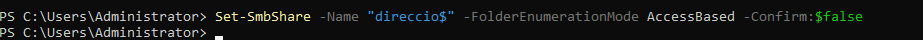

**Què es veu?**  
Comanda `Set-SmbShare` per activar `FolderEnumerationMode AccessBased`.

**Què s'està fent?**  
Es configura el share `direccio$` perquè només mostri els fitxers i carpetes als usuaris que hi tenen permís d'accés.

---

## 📸 Captura 42 – Server Manager (Vista general)

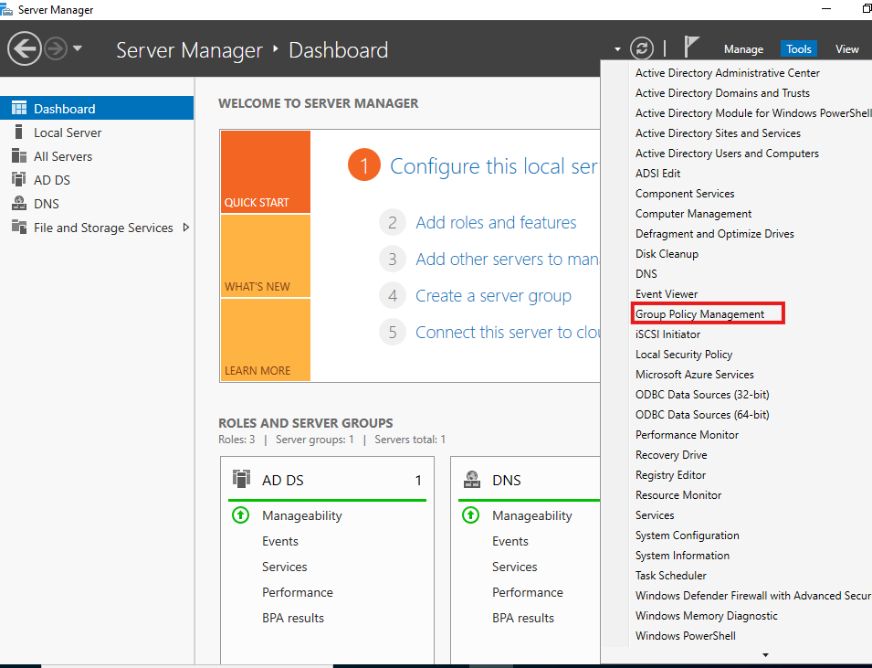

**Què es veu?**  
Dashboard del Server Manager amb els rols instal·lats (AD DS, DNS, File and Storage Services).

**Què s'està fent?**  
Es visualitza l'estat general del servidor i els serveis actius.

---

## 📸 Captura 43 – Group Policy Management

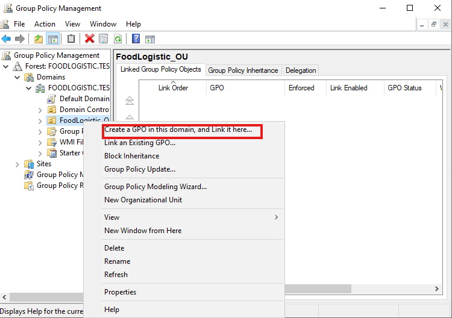

**Què es veu?**  
Consola de Group Policy Management amb l'OU `FoodLogistic_OU`.

**Què s'està fent?**  
Es prepara la creació d'una GPO per a l'OU de logística.

---

## 📸 Captura 44 – Creació d'una nova GPO

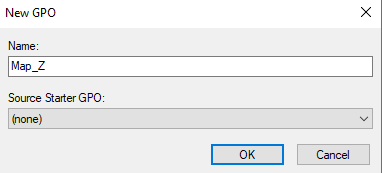

**Nom de la GPO:** `Map_Z`

**Què s'està fent?**  
Es crea una nova GPO per assignar unitats de xarxa als usuaris.

---

## 📸 Captura 45 – Preferències de la GPO (Mapped Drive)

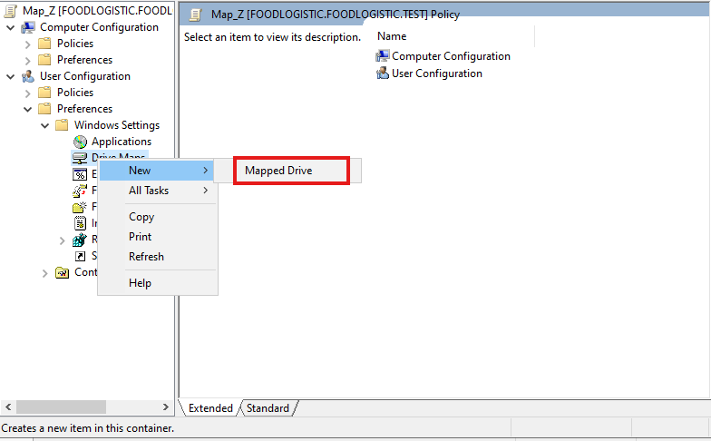

**Què es veu?**  
Editor de GPO amb l'opció `Mapped Drive` dins de Windows Settings > Preferences.

**Què s'està fent?**  
Es selecciona la creació d'una unitat de xarxa mapejada.

---

## 📸 Captura 46 – Configuració de la unitat de xarxa

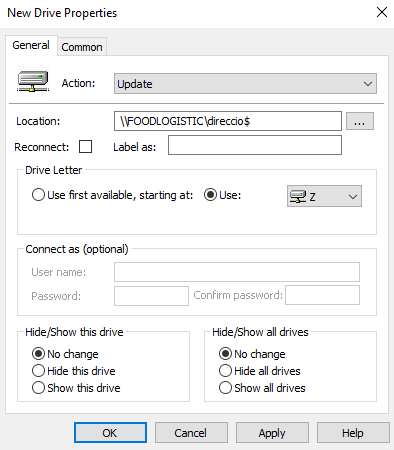

**Action:** Update  
**Location:** `\\FOODLOGISTIC\direccio$`  
**Drive Letter:** `Z:`

**Què s'està fent?**  
Es configura la unitat Z: que apunta al recurs compartit ocult `direccio$`.

---

## 📸 Captura 47 – Targeting (filtre per grup)

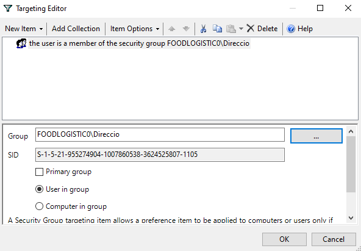

**Condició:** `the user is a member of the security group FOODLOGISTIC\Direccio`

**Què s'està fent?**  
S'aplica un filtre perquè només els membres del grup `Direccio` rebin aquesta unitat de xarxa.

---

## 📸 Captura 48 – GPO aplicada correctament

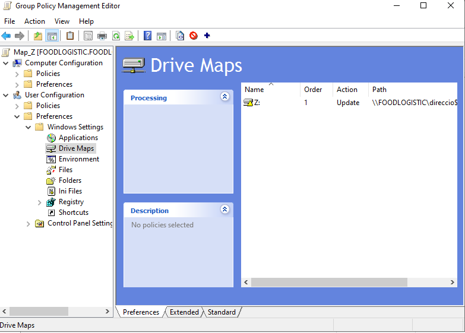

**Què es veu?**  
La unitat Z: apareix configurada dins de la GPO `Map_Z`.

**Què s'està fent?**  
Es confirma que la preferència de mapeig està activa i preparada per aplicar-se.

---

## 📸 Captura 49 – Configuració de quotes de disc

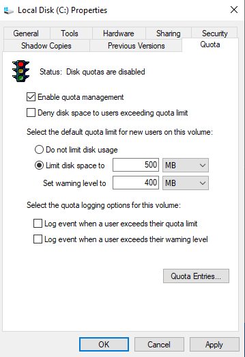

**Què es veu?**  
Propietats del disc C: amb l'opció de quotas habilitada.

**Què s'està fent?**  
Es configura un límit de `500 MB` per als usuaris amb avís a `400 MB`.

---

## 📸 Captura 50 – Instal·lació de File Server Resource Manager

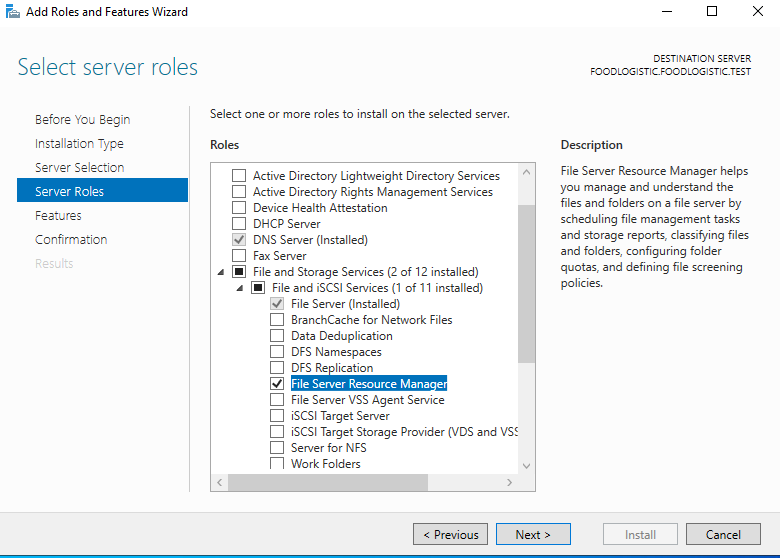

**Què es veu?**  
Assistent per afegir rols, seleccionant `File Server Resource Manager`.

**Què s'està fent?**  
S'instal·la l'eina per gestionar quotes i filtres d'arxius.

---

## 📸 Captura 51 – Creació d'una quota amb FSRM

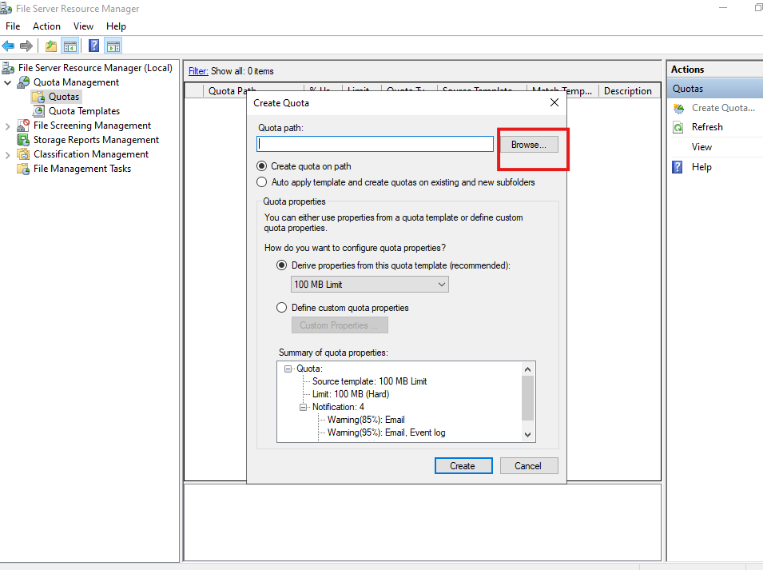

**Què es veu?**  
Assistent de `Create Quota` amb plantilla `100 MB Limit`.

**Què s'està fent?**  
Es comença a crear una quota per limitar l'espai a la carpeta compartida.

---

## 📸 Captura 52 – Quota aplicada a C:\Public

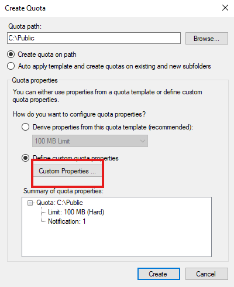

**Quota path:** `C:\Public`  
**Limit:** `100 MB` (Hard)

**Què s'està fent?**  
S'aplica una quota rígida de 100 MB a la carpeta `Public`.

---

## 📸 Captura 53 – (Imatge corrupta o no disponible)

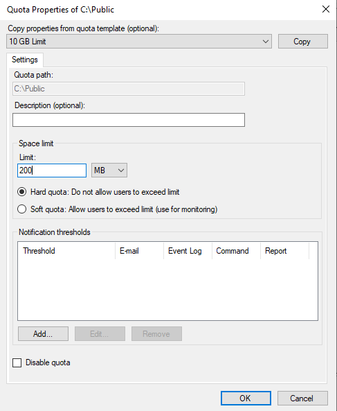

**Nota:** Aquesta captura no conté informació llegible.

---

## 📸 Captura 54 – Configuració de notificacions per quota

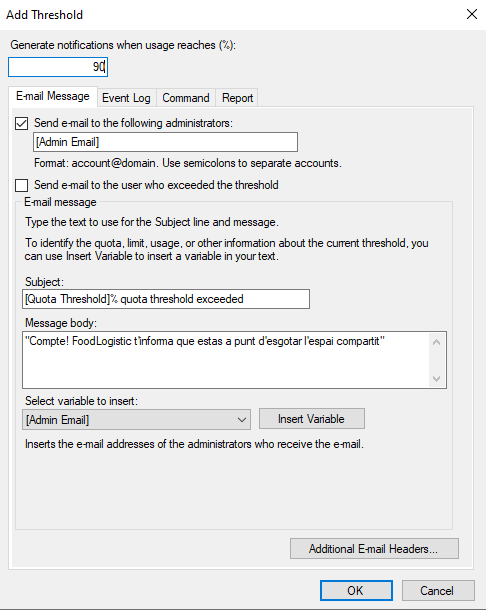

**Què es veu?**  
Finestra `Add Threshold` per definir alertes quan s'arribi al 90% d'ús.

**Què s'està fent?**  
Es configura un missatge d'email d'avís en català: *"Compte! FoodLogistic t'informa que estas a punt d'esgotar l'espai compartit"*

---

## 📸 Captura 55 – Desar com a plantilla de quota

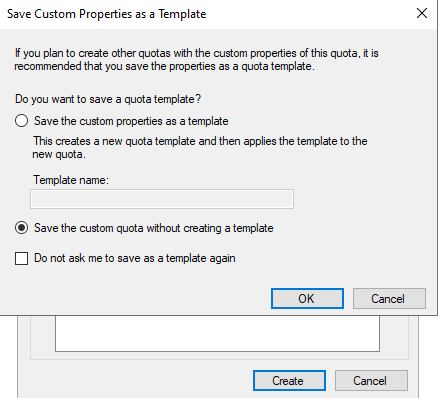

**Què es veu?**  
Opció per desar les propietats personalitzades com a plantilla.

**Què s'està fent?**  
Es decideix desar la quota actual com a plantilla per reutilitzar-la en altres carpetes.

---

## 📸 Captura 56 – File Screen (filtre d'arxius)

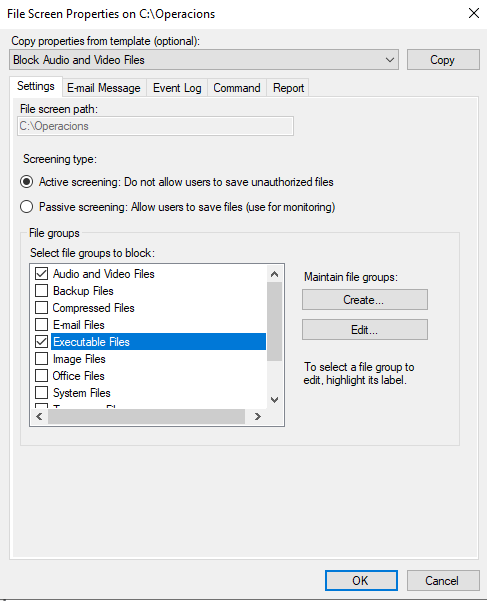

**Què es veu?**  
Propietats del file screen a `C:\Operacions`.

**Què s'està fent?**  
Es bloquegen arxius `Audio and Video Files` i `Executable Files`.

---

## 📸 Captura 57 – Creació del File Screen

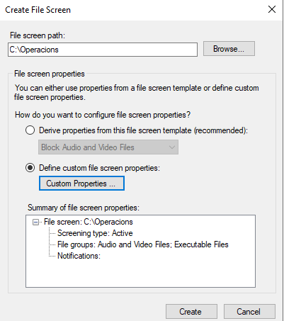

**File screen path:** `C:\Operacions`  
**Screening type:** Active  
**File groups:** Audio and Video Files; Executable Files

**Què s'està fent?**  
S'aplica un filre actiu per impedir que els usuaris guardin vídeos, àudio o executables.

---

## 📸 Captura 58 – Propietats del sistema (abans d'unir-se al domini)

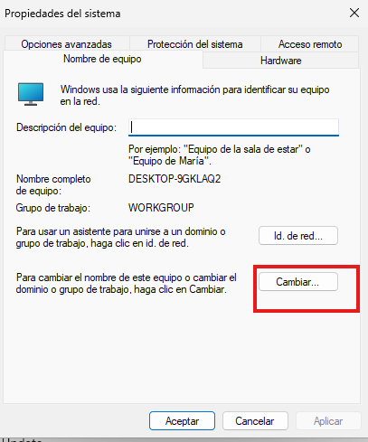

**Què es veu?**  
Configuració del sistema amb `Grupo de trabajo: WORKGROUP`.

**Què s'està fent?**  
Es prepara un equip per unir-lo al domini `FOODLOGISTIC.TEST`.

---

## 📸 Captura 59 – Confirmació d'unió al domini

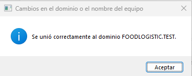

**Missatge:** `Se unió correctamente al dominio FOODLOGISTIC.TEST`

**Què s'està fent?**  
L'equip client s'ha unit correctament al domini.

---

## 📸 Captura 60 – Escriptori de l'usuari de transport

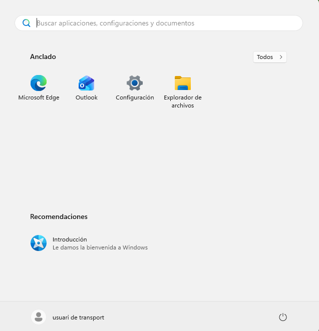

**Què es veu?**  
Inici de Windows amb l'usuari `usuari de transport`.

**Què s'està fent?**  
Es verifica que l'usuari del grup `Transport` pot iniciar sessió al domini.

---

## 📸 Captura 61 – Explorador de xarxa des del client

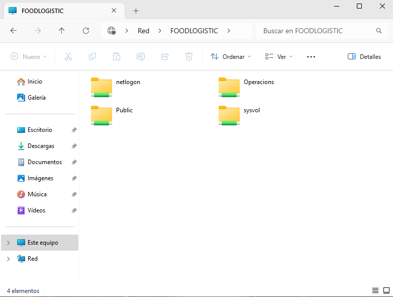

**Què es veu?**  
Recursos compartits del servidor `FOODLOGISTIC`:
- `netlogon`
- `Public`
- `Operaciones`
- `sysvol`

**Què s'està fent?**  
Es comprova que els usuaris poden veure i accedir als shares des del client.

## 📸 Captura 62 – Advertència de canvi d'extensió

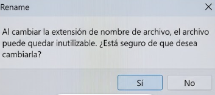

**Missatge:**  
`Al cambiar la extensión de nombre de archivo, el archivo puede quedar inutilizable. ¿Está seguro de que desea cambiarla?`

**Què s'està fent?**  
Es mostra l'advertència que apareix en intentar canviar l'extensió d'un fitxer, que pot deixar-lo inservible.

---

## 📸 Captura 63 – Inici de sessió de l'usuari de direcció

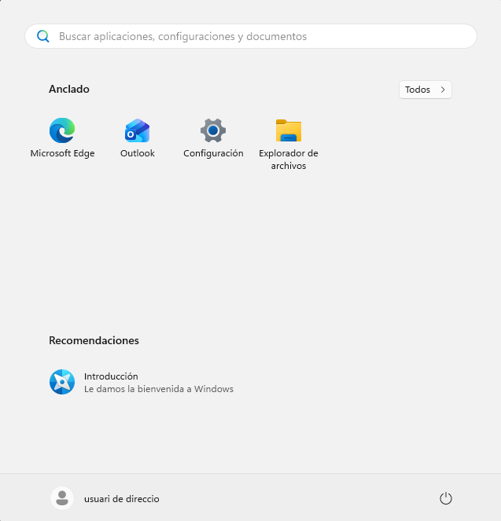

**Què es veu?**  
Menú d'inici de Windows amb l'usuari `usuari de direccio`.

**Què s'està fent?**  
Es verifica que l'usuari del grup `Direccio` pot iniciar sessió al domini correctament.

---

## 📸 Captura 64 – Unitat Z: mapejada automàticament

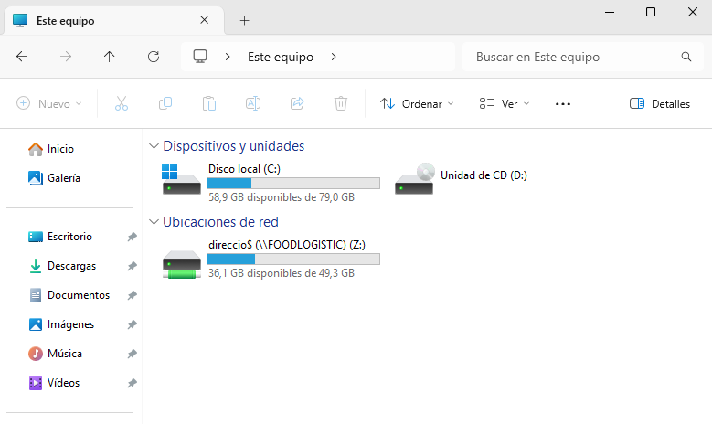

**Què es veu?**  
L'explorador de fitxers mostra la unitat `Z:` apuntant a `direccio$ (\FOODLOGISTIC)`.

**Què s'està fent?**  
Es comprova que la GPO `Map_Z` ha funcionat correctament i la unitat de xarxa està disponible per a l'usuari de `Direccio`.

---

## 📸 Captura 65 – Carpeta creada per l'usuari ferrán

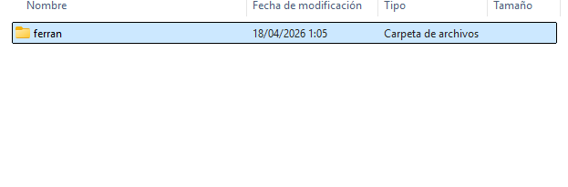

**Què es veu?**  
Dins d'un recurs compartit apareix una carpeta anomenada `ferrán`.

**Què s'està fent?**  
Un usuari ha creat una carpeta dins d'un share del servidor.

---

## 📸 Captura 66 – Error d'espai insuficient a Public

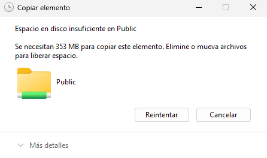

**Missatge:**  
`Espacio en disco insuficiente en Public. Se necesitan 353 MB para copiar este elemento.`

**Què s'està fent?**  
Es confirma que la quota de 100 MB aplicada a la carpeta `Public` està funcionant correctament, ja que no permet copiar un fitxer de 353 MB per falta d'espai.

---
